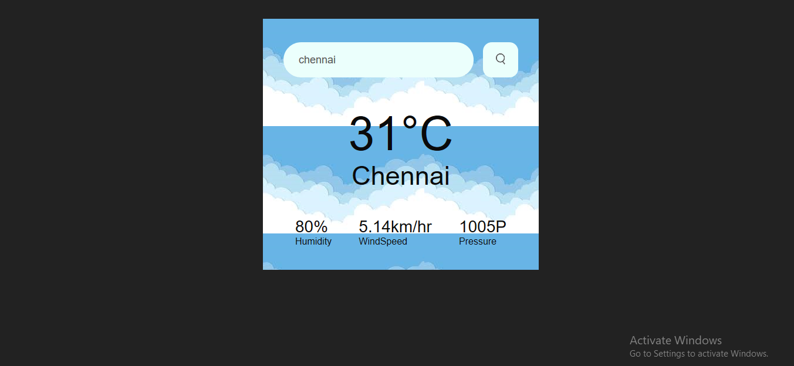

# Project README

This project was given by Prodigy Infotech as Task 1 in the domain Web Development.

## Description

This project is an Weather Webstie. It shows the weather condition (humidity,pressure,windspeed)of the given city. If you entered the Invalid city it show the message invalid.

Languages used: HTML, CSS

  

## File Structure

- `index.html`: The main HTML file for the webpage.
- `styles.css`: Directory containing CSS stylesheets.
- `screenshot.png`: The result of the task 1.
